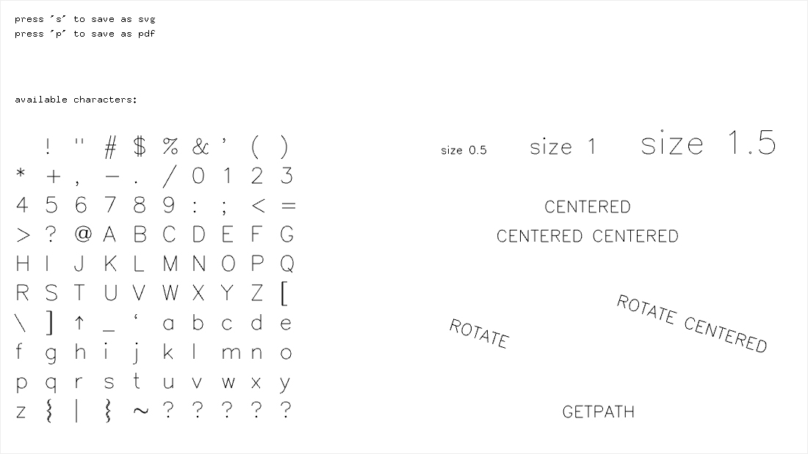

# ofxHersheyFont
A simple single line font for openFrameworks.

Best to be used if you want to carve/engrave text with machines like CNC-routers or lasercutters.

## Example-basic

## Supported platforms
Tested on Windows 8, OF 0.9.3.

Should work on other platforms as well.

## Credits
The Hershey Font was developed by Dr. Allen V. Hershey in 1967.

The addon contains the 'Simplex' characters of the Hershey Font (ASCII codes 32 – 126), which were made available by Paul Bourke.

http://paulbourke.net/dataformats/hershey/
